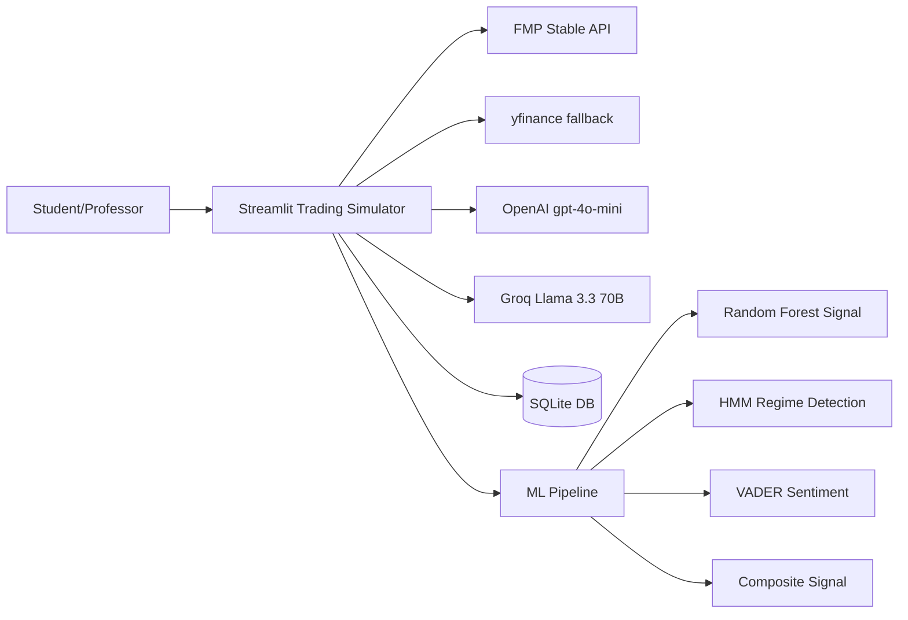

# Stock Portfolio Trading Simulator — Final Submission

## The Problem
A working trading simulator exists (4,874 lines, 12 modules, 8 pages) but has specific gaps identified in two rounds of professor feedback:
1. ML signals are shallow — Random Forest exists but uses arbitrary self-supervised labels and no proper time-series validation
2. DCF model has hardcoded assumptions (beta=1.0, fixed WACC components)
3. Coaching tips need richer context (regime, risk metrics)
4. No OpenAI GPT integration — using Groq/Gemini only
5. Known bugs: cost basis drift, VaR display, badge volatility
6. Missing: DRIVER documentation, validation evidence, AI log, inline code comments

## Success Looks Like
- **Genuine ML composite signal** — RF + HMM regime + VADER sentiment, each visible in UI
- **Interactive DCF** with calculated beta, sensitivity heatmap
- **OpenAI GPT** as primary LLM for chatbot + coaching
- **All known bugs fixed** — cost basis, VaR, badges, alerts
- **DRIVER documentation** in `driver-plan/` folder
- **Validation evidence** — cross-checked against known answers
- **AI Log** — transparent disclosure of all AI-assisted development
- **Professor can run the app** and see every feature working

## How We'd Know We're Wrong
- ML signal accuracy < 52% on out-of-sample data (worse than coin flip)
- DCF valuations consistently >2x off from analyst consensus
- OpenAI costs exceed $5/month at normal usage
- App load time exceeds 10 seconds

## Building On (Existing Foundations)
- **scikit-learn RandomForestClassifier** — already in ai_signals.py, needs TimeSeriesSplit + better features
- **hmmlearn GaussianHMM** — new, for 3-state regime detection (bull/sideways/bear)
- **vaderSentiment** — new, offline sentiment fallback
- **numpy-financial** — new, for proper NPV in DCF
- **openai SDK** — new, mirrors existing Groq pattern exactly
- **FMP stable API** — already working, keep as primary data source
- **SQLite** — already migrated from JSON, keep as-is

## The Unique Part
What we're building that doesn't exist yet:
1. **Composite ML Signal** — weighted blend of RF probability + HMM regime + sentiment, with individual component breakdown visible in UI
2. **Interactive DCF Sensitivity** — heatmap of intrinsic values across growth × discount rate combinations with calculated (not hardcoded) beta
3. **OpenAI-powered adaptive coaching** — context-enriched with regime state and risk metrics
4. **Full DRIVER documentation trail** — research → plan → validate → reflect

## Tech Stack
- **UI:** Streamlit (existing)
- **Data:** FMP stable API primary + yfinance fallback (existing)
- **ML:** scikit-learn (existing) + hmmlearn (new) + vaderSentiment (new)
- **LLM:** OpenAI gpt-4o-mini (new primary) + Groq (fallback) + Gemini (last resort)
- **Calculations:** numpy, pandas, numpy-financial (new)
- **Persistence:** SQLite via built-in sqlite3 (existing)
- **Charts:** Plotly (existing)

## System Context

## Open Questions (Resolved)
1. ~~Does the user have an OpenAI API key?~~ — **Yes**, user confirmed they have one.
2. ~~Should we keep Groq as primary or swap?~~ — **OpenAI is primary**, Groq fallback, Gemini last resort.
3. ~~How many slides needed?~~ — **5-10 slides** per final submission guidelines.
