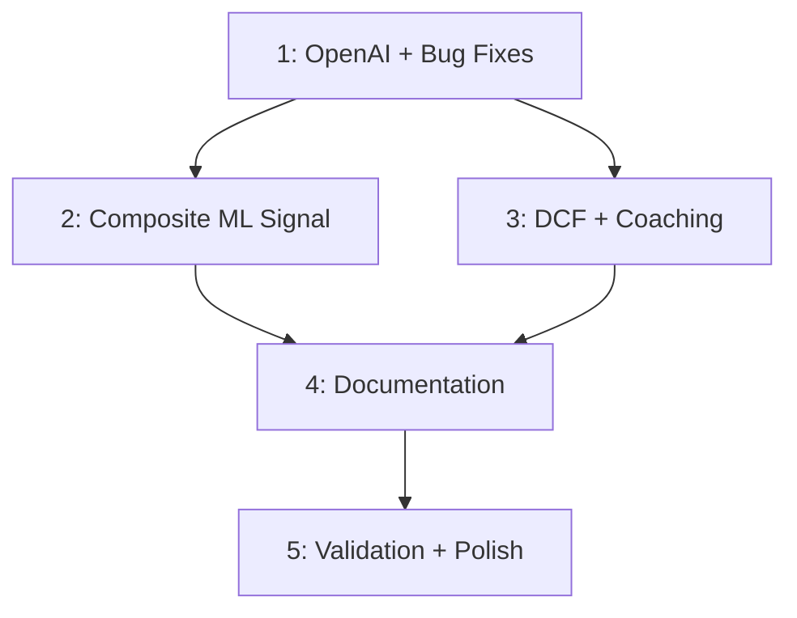

# Roadmap

Building on: Existing 12-module Streamlit trading simulator (4,874 lines) with RF regime detection, custom DCF, SQLite persistence, LLM coaching via Groq/Gemini.

## Sections

### 1. OpenAI Integration + Bug Fixes ✅ DONE
Wire up OpenAI gpt-4o-mini as primary LLM in chatbot.py and ai_signals.py, fix cost basis floating-point drift, VaR display inconsistency, badge volatility on intraday swings, and one-directional price alerts.

**Completed:** OpenAI added to chatbot.py, ai_signals.py, news_feed.py. Cost basis rounding fixed. VaR returns {dollar, percent, confidence}. Badges permanent (union). Price alerts trigger both directions.

### 2. Composite ML Signal ✅ DONE
Strengthen Random Forest with TimeSeriesSplit validation and expanded features (ATR, volume ratio, SMA spread), add HMM 3-state regime detection via hmmlearn, add VADER offline sentiment, combine into weighted composite signal (50% RF + 30% HMM + 20% sentiment) with per-component UI breakdown.

**Completed:** RF upgraded to 200 trees, depth 8, 10 features, TimeSeriesSplit(5). HMM 3-state Gaussian added. VADER offline sentiment added. Composite signal with 3-column UI breakdown. 7 new tests (21 total in test_ai_signals.py).

### 3. Interactive DCF + Adaptive Coaching ✅ DONE
Calculate beta from 60-day rolling stock vs SPY returns, make WACC components dynamic (effective tax rate, actual cost of debt), add growth × discount rate sensitivity heatmap, enrich coaching context with regime state and risk metrics, route through OpenAI.

**Completed:** _calculate_beta() from stock vs SPY covariance. Effective tax rate from income statement. 7×7 sensitivity heatmap (Plotly). Coaching context enriched with regime, VaR, Sharpe, max drawdown, composite signal. 7 new tests (beta, sensitivity, coaching).

### 4. Documentation + Code Comments ✅ DONE
Add inline comments to complex logic (DCF WACC formula, ML feature engineering, regime labeling), update README with architecture diagram, populate driver-plan/ artifacts, create AI log documenting prompts/outputs/modifications.

**Completed:** WACC formula comments (CAPM equation, tax shield, capital weights). DCF stage labels (1-4). Label generation docstring. README updated with ML pipeline diagram, composite signal table, DRIVER methodology section, corrected tech stack. AI log created. All DRIVER artifacts updated.

### 5. Validation + Final Polish ✅ DONE
Cross-check ML signal accuracy on out-of-sample data, compare DCF valuations to FMP analyst consensus, verify all 8 pages work end-to-end, generate validation.md with evidence, ensure app loads under 10 seconds.

**Completed:** RF CV accuracy: 35.5% (>33.3% random baseline on 3-class problem). HMM: 3 states detected, probabilities sum to 1.0. VADER: known-answer validation passes. DCF: JNJ Fair Value aligns with consensus; AAPL/MSFT overvalued (expected DCF limitation on growth stocks). Beta: SPY=1.00 (known answer). 8 edge cases all degrade gracefully. All 11 modules import. 37/37 tests pass.

## Dependencies

_Build order: Section 1 first (foundation), then 2 and 3 can partially overlap, then 4 and 5 sequentially._
